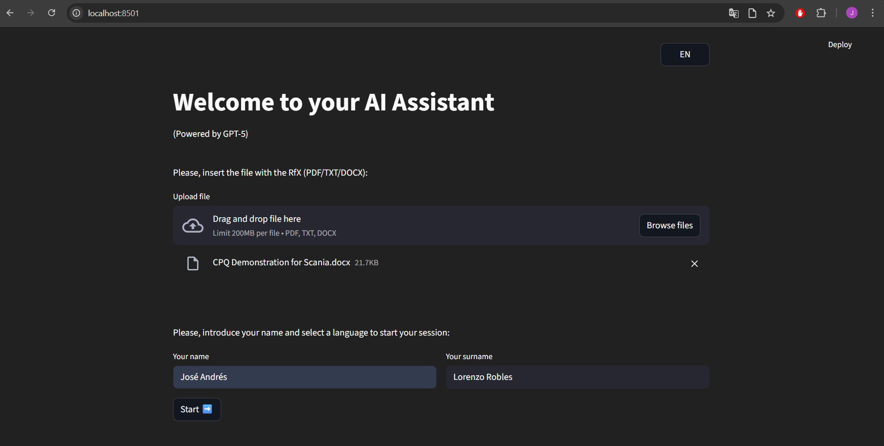
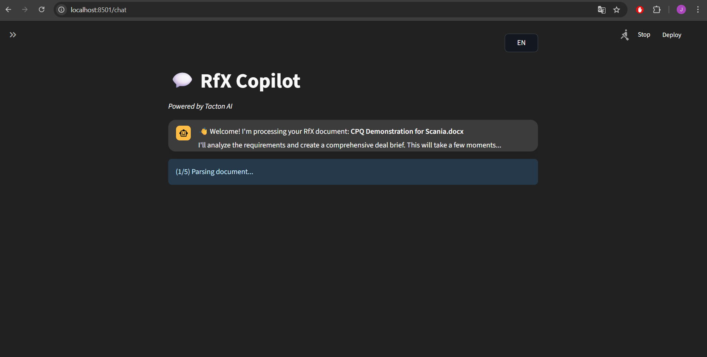
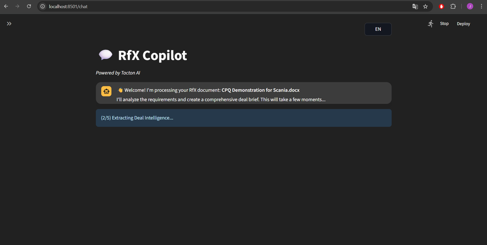
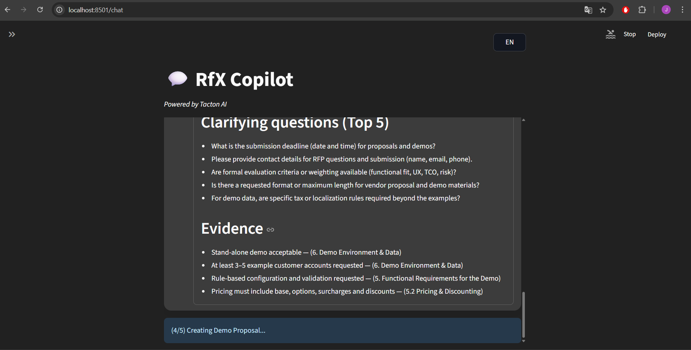
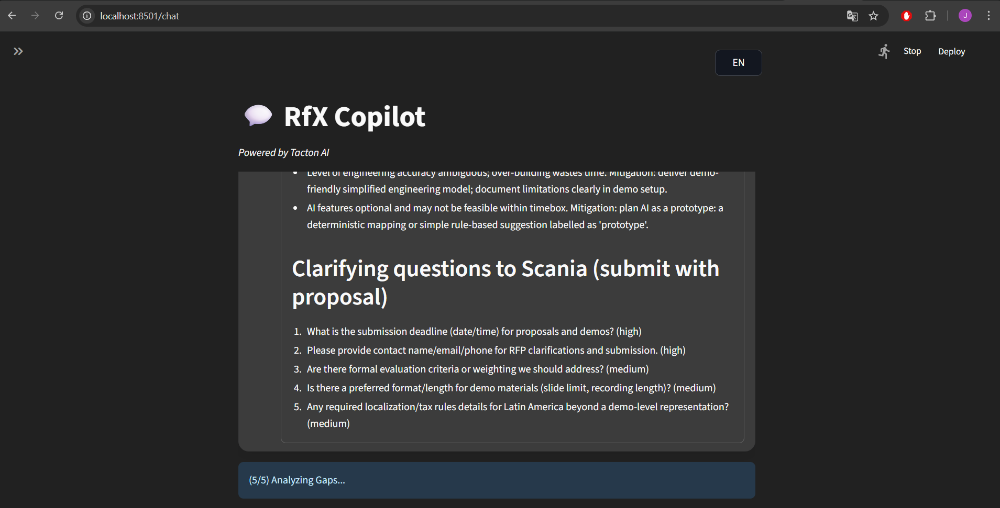
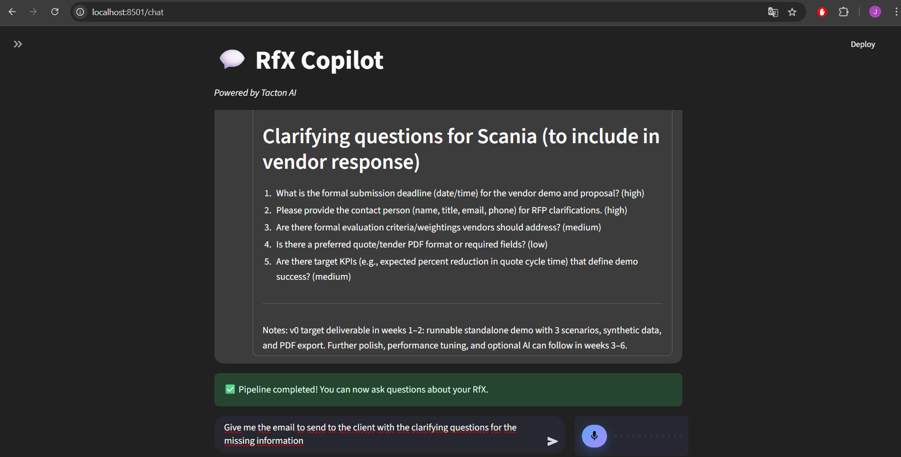
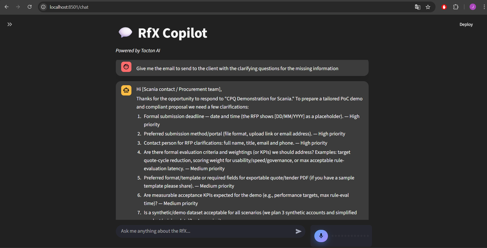

## RfX Copilot — Multi‑Agent system for Sales teams support for demo generation

An AI copilot that ingests complex RfX documents, builds deal intelligence, designs a demo proposal, and lets sales teams interrogate everything through a rich conversational UI.

> ⚠️ **Disclaimer**: This is a prototype for evaluation and demo purposes only made for Tacton. It is **not** a production system, does not provide legal, commercial or financial advice, and must be reviewed by security, compliance and legal teams before any real‑world use.

---

## Objectives

- **End‑to‑end RfX pipeline**: upload an RfX (PDF, DOCX or TXT) and automatically process it through a multi‑step pipeline.
- **Deal Intelligence Card (DIC)**: extract requirements and key metadata into a concise, executive‑level view of the opportunity.
- **Demo Brief generation**: propose a demo storyline and solution blueprint aligned with the RfX requirements.
- **Gap analysis**: highlight gaps and risks between customer requirements and the proposed solution.
- **Conversational copilot**: ask questions about the deal and RfX via **text** or **voice**; get grounded answers.
- **Multilingual**: English / Svenska (UI + model prompts).

---

## Repository Structure

```text
root/
├── backend/                      # FastAPI backend (clean architecture: domain, application, infrastructure, interface)
│   ├── application/              # Use cases and pipeline orchestration (RfX pipeline, chat agent, agents)
│   ├── domain/                   # Core business entities and repositories (Deal, DealContext, ChatMessage, Document, ...)
│   ├── infrastructure/           # OpenAI adapters, DB/Chroma adapters, persistence implementations
│   └── interface/                # FastAPI app, routers (chat, deals, health), HTTP schemas & dependencies
├── frontend/                     # Streamlit UI (navigation, views, styling)
│   ├── app.py                    # Entry point & page routing
│   ├── views/                    # `Home` (upload) and `Chat` (RfX copilot)
│   └── utils/                    # Config, CSS, HTTP helpers, language selector
├── data/
│   ├── deals/                    # Serialized deals (if configured)
│   ├── documents/                # Parsed / normalized documents
│   ├── logs/                     # JSONL logs & pipeline events
│   └── uploads/                  # Temporary uploaded files
├── chroma_db/                    # Local Chroma vector store (HNSW index + SQLite metadata)
├── docker-compose.yml            # Local dev stack (backend + frontend + DB)
├── docker-compose.prod.yml       # Example production‑ready stack
├── dockerfiles/                  # Backend & frontend Dockerfiles
├── main.py                       # Orchestrates backend + frontend processes
├── requirements.txt              # Python dependencies
├── Caddyfile                     # Example Caddy reverse‑proxy / TLS config
└── README.md
```

---

## Architecture

```text
┌────────────────┐           file upload / chat           ┌────────────────────┐     LLM / embeddings / STT / TTS     ┌────────────────────┐
│   Streamlit    │  ───────────────────────────────────▶  │      FastAPI       │  ─────────────────────────────────▶ │      OpenAI API    │
│  (frontend)    │  ◀────────── text / audio ───────────  │   (backend API)    │  ◀──────── vectors / outputs ─────  │  (LLM / STT / TTS) │
└────────────────┘                                        └──────────┬─────────┘                                      └────────────────────┘
                                                                  events / logs
                                                                       │
                                                                       ▼
                                                         ┌──────────────────────────────┐
                                                         │  DB + Chroma vector store    │
                                                         └──────────────────────────────┘
```

- **Streamlit** hosts the Home & Chat UI, microphone controls, language selector and pipeline progress visualisation.
- **FastAPI** exposes endpoints for RfX ingestion, pipeline status, chat/Q&A, STT and TTS.
- **OpenAI** (configurable) powers the multi‑agent pipeline (ingestion, deal analyzer, summarizer, solution architect, engagement manager) plus chat, STT and TTS.
- All interactions and pipeline steps are **logged** with ISO‑8601 timestamps and a per‑deal identifier.

---

## Architecture & Engineering Highlights
### Modern architecture based in Clean Architecture principles
- Explicit separation into Domain, Application, Infrastructure and Interface layers in the backend (backend/domain, backend/application, backend/infrastructure, backend/interface).
- **Domain layer** is framework‑agnostic (pure entities, value objects, repositories and services).
- **Application layer** encapsulates use cases (pipeline steps, chat agent) and only depends on domain abstractions.
- **Infrastructure layer** implements adapters for OpenAI, SQL databases, Chroma vector DB and file storage.
- **Interface layer** exposes FastAPI routers and schemas, plus dependency wiring for use cases and adapters.

### Multi‑agent, modular design
- Independent agents for **Ingestion**, **Deal Analyzer**, **Summarizer**, **Solution Architect**, **Engagement Manager** and **Chat**, each with its own use cases and adapters.
- Shared services (LLM provider, embeddings, vector DB, event store) injected via interfaces for easy swapping and testing.
- Pipeline orchestrator (PipelineRunner) coordinates agents and emits structured events for the UI.

### Persistence & observability
- Relational database via SQLAlchemy + Alembic (PostgreSQL or SQLite), plus local file repositories for some artifacts.
- ChromaDB as a vector store, with a dedicated directory (chroma_db/) to keep the HNSW index and metadata.
- Structured JSONL logging in data/logs/ with per‑deal events and error reporting.

### Multi‑Agent RfX Pipeline

The backend implements a sequential, multi‑agent pipeline (`PipelineRunner`) that processes each uploaded RfX:

- **Ingestion Agent**: parses the RfX file, splits it into chunks, embeds them and stores them in Chroma.
- **Deal Analyzer Agent**: builds a structured **Deal Context** and identifies key requirements, producing the base for the **Deal Intelligence Card (DIC)**.
- **Summarizer Agent**: turns the deal context into an executive‑level DIC in markdown.
- **Solution Architect Agent**: generates a detailed **Demo Brief** (demo storyline, flows, personas, configuration focus).
- **Engagement Manager Agent**: performs **Gap Analysis** between the RfX requirements, the demo brief and relevant RfX chunks, highlighting risks and gaps.

The **Chat Agent** then uses all of these artifacts (deal context, RfX chunks, DIC, demo brief, gaps) as retrieval‑augmented context to answer user questions about the deal.

---

## Main Features

- **RfX upload & processing**
  - Upload a single RfX in **PDF / DOCX / TXT** format from the Home page.
  - The system starts the pipeline in the background and reports progress in real time.
- **Deal Intelligence Card (DIC)**
  - Executive summary of the opportunity with requirements, scope and key metadata.
- **Demo Brief generation**
  - Suggested demo storyline and solution focus, aligned with the extracted requirements.
- **Gap analysis**
  - Structured list of gaps and risks, with severity levels and supporting context.
- **Conversational copilot**
  - Chat with the copilot about any aspect of the RfX or generated artifacts.
  - Supports both **text input** and **voice input** (STT), and optional **voice output** (TTS).
- **Bilingual UX**
  - English / Svenska UI, plus language selector and prompt conditioning for LLM calls.
- **Clean, extensible architecture**
  - Strict layering (Domain / Application / Infrastructure / Interface) with clear module boundaries.
  - Pluggable LLM provider and vector DB via abstractions and adapters.

---

## Technologies Used

- **Python 3.10+**, **FastAPI + Uvicorn**, **Streamlit**
- **SQLAlchemy + Alembic** for relational persistence (PostgreSQL or SQLite)
- **ChromaDB** for vector search and semantic retrieval
- **OpenAI** for LLM, embeddings, STT and TTS
- **Pydantic / pydantic‑settings** for configuration and HTTP schemas
- **LangChain text splitters** for document chunking

---

## Docker & Deployment
### Docker‑first local setup
- docker-compose.yml to spin up the full stack (backend API, Streamlit frontend, database and vector store) for local development.
- docker-compose.prod.yml used for cloud production deployment.
- Separate dockerfiles/backend.Dockerfile and dockerfiles/frontend.Dockerfile to build slim images per service.

### Reverse proxy & TLS with Caddy
- Caddyfile shows how to place Caddy in front of the stack, acting as a reverse proxy and TLS termination point.
- Suitable as a starting point for deploying on a VM or single‑node environment with HTTPS.

### Config‑driven runtime
- All critical settings (ports, CORS, database URL, OpenAI models, etc.) are environment‑driven via .env and pydantic-settings.
- This makes it straightforward to move from local development to staging/production by just changing configuration.

---

## Prerequisites

- **Python**: 3.10 or newer.
- **Audio tooling**: `ffmpeg` available on your `PATH` (required for audio recording/playback in Streamlit).
- **OpenAI**:
  - An `OPENAI_API_KEY` with access to a chat model, an embeddings model and STT/TTS models.
- **Database**:
  - For a quick local run you can use the default settings (SQLite / local files).
  - For a more realistic setup, configure a PostgreSQL instance (see `backend/infrastructure/shared/config/settings.py`).

If you hit binary issues on some platforms, you can pin **`numpy<2`** in `requirements.txt` as a fallback.

---

## Installation & Execution

```bash
# Clone
git clone <this-repo-url>
cd <this-repo-folder>

# Create and activate virtual environment
python -m venv .venv
# Windows (PowerShell)
.venv\Scripts\Activate.ps1
# macOS / Linux
source .venv/bin/activate

# Install dependencies
pip install -U pip
pip install -r requirements.txt

# Configure environment
# Copy the template and fill in OPENAI_API_KEY and DB settings
cp .env.example .env   # On Windows: Copy-Item .env.example .env

# Run (starts FastAPI on :8000 and Streamlit on :8501)
python main.py
```

The launcher in `main.py` will start the backend, wait for it to be healthy, start the frontend, and open the browser automatically.

---

## Configuration (.env)

The project uses `pydantic-settings` and a layered configuration model. The most relevant variables are:

- **OpenAI / LLM**
  - `OPENAI_API_KEY` — **required**, your OpenAI API key.
  - `OPENAI_MODEL` — main chat / agent model (see `LLMSettings.openai_model` for defaults).
  - `OPENAI_MODEL_STT` — speech‑to‑text model ID.
  - `OPENAI_MODEL_TTS` — text‑to‑speech model ID.
  - `OPENAI_MODEL_EMBEDDING` — embeddings model for RfX chunks.
- **Web ports & CORS**
  - `PORT_FRONTEND` — Streamlit port (default: `8501`).
  - `PORT_BACKEND` — FastAPI port (default: `8000`).
  - `BACKEND_URL` — base URL that the frontend uses to talk to the backend.
  - `ALLOWED_ORIGINS` — comma‑separated list of origins allowed by CORS (lock down in production).
- **Database**
  - Database settings are defined in `DatabaseSettings` (see `backend/infrastructure/shared/config/settings.py`), including `database_type`, `database_url`, `pool_size` and `max_overflow`.
  - By default the project points to a local PostgreSQL instance; override these values in `.env` to match your environment.

---

## Usage

1. **Open the app**
   - After running `python main.py`, your browser should open on the Streamlit UI (`http://127.0.0.1:8501`).  
2. **Onboard on the Home page**
   - Select your preferred **language** (EN / SV).
   - Enter your **name/surname**.
   - Upload an **RfX document** (PDF, DOCX, TXT).
3. **Let the RfX pipeline run**
   - The app uploads the file and triggers the multi‑agent pipeline.
   - Watch progress updates (Ingestion → Deal Analyzer → Summarizer → Solution Architect → Engagement Manager).
   - As artifacts become available, they appear as rich assistant messages in the chat (DIC, Demo Brief, Gap Analysis).
4. **Chat with the copilot**
   - Ask questions via the **chat input** (text) or use the **microphone** to send audio.
   - The backend uses RAG over RfX chunks + DIC + demo brief + gaps to generate grounded answers.
   - Optionally play back answers using TTS where enabled.
5. **Start new conversations**
   - Use the **“New Conversation”** button in the sidebar to reset the session and/or process a different RfX.

---

## API Overview (selected)

- **`GET /health`** → `{ "status": "ok" }`  
  Basic health check used by the launcher and the frontend.

- **`POST /deals`** (multipart form: `file`, `session_id`, `language`)  
  Starts the RfX pipeline for a given file and returns `{ "deal_id": "<id>" }`.

- **`GET /deals/{deal_id}`** (query: `since_event_id`)  
  Returns current deal status, pipeline step, events and (when ready) markdown outputs: DIC, demo brief, gap analysis.

- **`POST /chat`** (JSON: `session_id`, `text_message`, `language`, optional `deal_id`)  
  Generates a grounded answer from the Chat Agent: `{ "answer": "...", "stage": "qa" | "welcome" | ... }`.  
  If the deal is still processing or in error, appropriate HTTP 409 responses are returned.

- **`POST /stt`** (multipart form: `file`)  
  Transcribes audio to text: `{ "transcription": "..." }`.

- **`POST /tts`** (JSON: `session_id`, `text_message`, `language`)  
  Returns raw audio bytes (WAV) for TTS playback.

---

## Important Considerations

- **Prototype only**: not hardened for security, multi‑tenancy, rate‑limiting or large‑scale workloads.
- **PII & logs**: uploaded RfX files and derived artifacts can contain sensitive data; logs are written under `data/logs/`. Treat them as confidential and avoid committing them to source control.
- **OpenAI usage**: be aware of data‑handling policies and costs when using foundation models against customer data.
- **Production hardening**: use HTTPS, strict CORS, secrets management (not plain `.env`), proper database credentials and observability before exposing this externally.

---

## Roadmap (short)

- **Realtime streaming STT & chat** (token‑level streaming to the UI).
- **Deeper RAG over historic RfX repositories** with citations and filtering.
- **CRM integration** (e.g., pushing DIC / demo brief / gaps back into opportunity records).
- **Multi‑deal dashboard** to browse, filter and compare RfX analyses.
- **Advanced evaluation**: quality metrics, human feedback loops and safety guardrails.

---

## Images

Here are provided some images of the flow of the multi-agent system:

1) Home page



2) Start of flow ingesting the document



3) Deal Analyzer Agent extracts the information from RfX as a structured JSON



4) Generates short summary to make easier to understand the requirements to the user


5) Creates the Demo Proposal based on the requirements



6) Audits the proposed demo analyzing the gaps with the RfX



7) Once finished, the user can ask whatever he needs.



8) Response for an email generation based on the previous analysis.



---

## License

MIT — see `LICENSE`.

### Author

José Andrés Lorenzo — `https://github.com/joseandres94`
